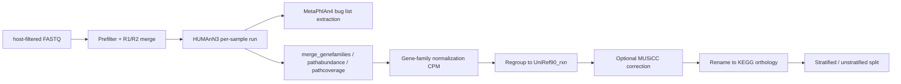

# Humann


Shotgun metagenome functional profiling workflow using HUMAnN3 + MetaPhlAn4 with optional MUSiCC correction, gene-family normalization, and KEGG orthology regrouping.

## Current Entrypoints

- Wrapper: `Go_Humann.sh`
- Snakefile (current): `Go_Humann_V1.smk`
- Auxiliary scripts:
  - `scripts/humann_masterlog.py`: merges per-sample HUMAnN logs into `humann3_log.txt`
- Helper examples:
  - `check_humann_logs_example.sh`
  - `run_humann_retry_example.sh`

## Pipeline



## Requirements

- Docker
- Linux shell
- Host-filtered FASTQ files (single-end, paired-end, or `_nohuman` outputs from KneadData / host removal)
- HUMAnN3 reference DBs:
  - `chocophlan/` nucleotide DB
  - `uniref/` protein DB
- MetaPhlAn4 DB directory + index basename (e.g. `mpa_vJan25_CHOCOPhlAnSGB_202503`)

## Build

```bash
cd Humann
docker build --network=host -t humann:1.0 .
```

The wrapper defaults to image `humann:1.0`; override with `-m <tag>` if needed.

## Docker Tool Inventory

Representative tools in the image:

- `snakemake`
- `humann` (HUMAnN3 toolchain: `humann`, `humann_renorm_table`, `humann_regroup_table`, `humann_rename_table`, `humann_join_tables`, `humann_split_stratified_table`)
- `metaphlan` (MetaPhlAn4)
- `musicc` (optional correction)
- supporting Python utilities for log merging

## Run A Single Tool From The Image

```bash
docker run --rm humann:1.0 snakemake --version
docker run --rm humann:1.0 humann --version
docker run --rm humann:1.0 metaphlan --version
```

## Quick Start

```bash
./Humann/Go_Humann.sh \
  -i /path/to/host_filtered_fastq \
  -o humann_run \
  -n /media/uhlemann/core4/DB/humann_db/humann3/chocophlan \
  -p /media/uhlemann/core4/DB/humann_db/humann3/uniref \
  -b /media/uhlemann/core4/DB/humann_db/metaphlan4 \
  -I mpa_vJan25_CHOCOPhlAnSGB_202503 \
  -c 8 -j 4 -t 4 \
  --run-musicc \
  -K
```

Real example:

```bash
Go_Humann.sh \
  -i 1_host_filtered \
  -o 2_humann_out \
  -n /media/uhlemann/core4/DB/humann_db/humann3/chocophlan \
  -p /media/uhlemann/core4/DB/humann_db/humann3/uniref \
  -b /media/uhlemann/core4/DB/humann_db/metaphlan4 \
  -I mpa_vJan25_CHOCOPhlAnSGB_202503 \
  -s /home/uhlemann/heekuk_path \
  -c 8 -j 4 -t 4 \
  --run-musicc \
  -K
```

## Options (`Go_Humann.sh`)

| Flag | Default | Description |
|---|---:|---|
| `-i` | - | Input FASTQ directory (host-filtered reads) |
| `-o` | - | Output directory |
| `-n` | - | HUMAnN3 nucleotide DB (`chocophlan`) |
| `-p` | - | HUMAnN3 protein DB (`uniref`) |
| `-b` | - | MetaPhlAn4 DB directory (or `.pkl` for legacy shortcut) |
| `-I` / `--metaphlan-index` | - | MetaPhlAn4 index basename (without `.pkl`) |
| `-s` | script directory | Optional Snakefile directory override |
| `-c` | `8` | Snakemake cores |
| `-j` | `4` | Snakemake jobs |
| `-t` | `4` | HUMAnN threads per sample |
| `-m` | `humann:1.0` | Docker image tag |
| `-x` | off | Dry-run (`--dry-run`) |
| `-K` | off | Keep going (`--keep-going`) |
| `--run-musicc` | off | Enable MUSiCC correction on regrouped KO table |
| `--skip-gene-norm` | off | Skip gene-family normalization step |
| `--skip-path-split` | off | Skip pathway split (stratified/unstratified) |
| `--skip-pathcoverage` | off | Skip pathcoverage merge |

## Workstation Layout

After `Go_toWorkstation.sh Humann`, files are placed as:

```text
/home/uhlemann*/heekuk_path/
  Go_Humann.sh
  Go_Humann.smk
  scripts/
    humann_masterlog.py
  docker/Humann/
    Dockerfile
```

## Input Layout

Supported FASTQ naming:

- Single-end / pre-merged: `<sample>.fastq.gz`, `<sample>.fq.gz`, `<sample>.fastq`, `<sample>.fq`
- Paired: `<sample>_R1.fastq.gz` / `<sample>_R2.fastq.gz` (auto-merged into `7_intermediate/<sample>.merged.fastq.gz`)
- Host-filtered paired: `<sample>_R1_nohuman.fastq.gz` / `<sample>_R2_nohuman.fastq.gz`

Each detected FASTQ unit is processed as one HUMAnN job.

## Output Layout

```text
OUT/
  1_humann3_out/
    <sample>_genefamilies.tsv
    <sample>_pathabundance.tsv
    <sample>_pathcoverage.tsv
    <sample>.humann.done
  2_humann3_final_out/
    merged_genefamilies.txt
    merged_pathabundance.txt
    merged_pathcoverage.txt
  3_MetaPhlAn_bug_list/
    <sample>_metaphlan_bugs_list.tsv
  4_kegg-orthology/
    merged_genefamilies_cpm.txt
    merged_genefamilies_uniref90_rxn_cpm.txt
    merged_genefamilies_uniref90_rxn_musicc.txt
    merged_genefamilies_uniref90_rxn_kegg-orthology_cpm.txt
    stratified_out/
      merged_genefamilies_uniref90_rxn_kegg-orthology_cpm_unstratified.txt
      merged_genefamilies_uniref90_rxn_kegg-orthology_cpm_unstratified_filtered.txt
  5_pathabundance_stratified_out/
    merged_pathabundance_unstratified.txt
  6_logs/
    *.log
  7_intermediate/
    <sample>.merged.fastq.gz
    <sample>.input.done
  humann3_log.txt
```

Key files:

- `2_humann3_final_out/merged_genefamilies.txt`
- `2_humann3_final_out/merged_pathabundance.txt`
- `3_MetaPhlAn_bug_list/<sample>_metaphlan_bugs_list.tsv`
- `4_kegg-orthology/merged_genefamilies_uniref90_rxn_kegg-orthology_cpm.txt`
- `humann3_log.txt`

## Direct Snakemake Run (no wrapper)

```bash
fastq_dir="host_filtered_fastq"
output_dir="humann_run"
chocophlan="/media/uhlemann/core4/DB/humann_db/humann3/chocophlan"
uniref="/media/uhlemann/core4/DB/humann_db/humann3/uniref"
metaphlan_db="/media/uhlemann/core4/DB/humann_db/metaphlan4"
metaphlan_index="mpa_vJan25_CHOCOPhlAnSGB_202503"

snakemake --snakefile /home/uhlemann/heekuk_path/Go_Humann.smk \
  --config \
  fastq_dir="$fastq_dir" \
  output_dir="$output_dir" \
  nucleotide_db="$chocophlan" \
  protein_db="$uniref" \
  metaphlan_db="$metaphlan_db" \
  metaphlan_index="$metaphlan_index" \
  run_musicc=true \
  humann_threads=4 \
  --cores 8 --jobs 4 \
  --latency-wait 60 --rerun-incomplete
```

## Useful Configs

```bash
--config \
  fastq_dir=host_filtered_fastq \
  output_dir=humann_run \
  nucleotide_db=/path/to/chocophlan \
  protein_db=/path/to/uniref \
  metaphlan_db=/path/to/metaphlan_db \
  metaphlan_index=mpa_vJan25_CHOCOPhlAnSGB_202503 \
  run_musicc=false \
  humann_threads=4 \
  run_gene_norm=true \
  run_path_split=true \
  run_pathcoverage_merge=true
```

## Operational Notes

- Recommended MetaPhlAn input is `-b <metaphlan_db_dir>` plus `-I <index_basename>`.
- `Go_Humann.sh` also accepts a `.pkl` path via `-b` and auto-converts it to directory + index for backward compatibility.
- Input discovery is intentionally simple: every `*.fastq`, `*.fq`, `*.fastq.gz`, `*.fq.gz` is treated as one HUMAnN input unit.
- Paired inputs (`_R1` / `_R2` or `_R1_nohuman` / `_R2_nohuman`) are merged per sample into `7_intermediate/<sample>.merged.fastq.gz` before HUMAnN.
- Per-sample `.humann.done` markers let interrupted runs resume cleanly.
- `MetaPhlAn_bug_list` files are extracted from `{sample}_humann_temp/` before that temp directory is removed.
- Output directories are numbered in run order (`1_` through `7_`).
- `--run-musicc` enables MUSiCC correction on the regrouped KO table before `humann_rename_table`.
- `--skip-gene-norm` is useful if only raw HUMAnN tables are needed.
- `--skip-path-split` is useful when stratified split is not needed for the current project.
- Lock errors are auto-handled by the wrapper (`--unlock` then retry).

## Common Runs

Dry-run:

```bash
./Humann/Go_Humann.sh -i IN -o OUT -n CHOCO -p UNIREF -b MPA -I mpa_index -x
```

Production run with MUSiCC:

```bash
./Humann/Go_Humann.sh -i IN -o OUT -n CHOCO -p UNIREF -b MPA -I mpa_index --run-musicc -K
```

Skip normalization (raw HUMAnN tables only):

```bash
./Humann/Go_Humann.sh -i IN -o OUT -n CHOCO -p UNIREF -b MPA -I mpa_index --skip-gene-norm -K
```

## Troubleshooting

- `Docker image not found locally: humann:1.0`
  - build with `docker build -t humann:1.0 Humann`
- MetaPhlAn DB errors mentioning `mpa_*.pkl` not found
  - pass `-b <dir>` and `-I <index_basename>`, not the `.pkl` itself (or use the legacy `.pkl` shortcut)
- Lock-related failure in `humann.log`
  - wrapper retries with `--unlock` automatically; if it persists, remove `.snakemake/locks/` manually
- HUMAnN exits with `chocophlan / uniref not found`
  - confirm the DBs exist under the directories passed to `-n` and `-p`
- Want only Kraken/Bracken profiling instead
  - use `KBracken` pipeline (separate)

## Maintainer

Heekuk Park
