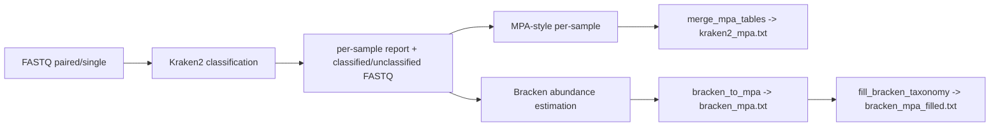

# KBracken


Snakemake + Docker rewrite of `Gobracken2_V4.pl` for Kraken2 taxonomic classification with optional Bracken abundance estimation and merged MPA-style outputs.

## Current Entrypoints

- Wrapper: `Go_KBracken.sh`
- Snakefile (current): `Go_KBracken_V1.smk`
- Auxiliary scripts:
  - `scripts/merge_mpa_tables.py`: fixed local replacement for `merge_metaphlan_tables.py`
  - `scripts/bracken_to_mpa.py`: Bracken table → MPA-style table
  - `scripts/fill_bracken_taxonomy.py`: adds Kraken2 taxonomy ranks to merged Bracken table
  - `scripts/kraken_masterlog.py`: creates `kraken2_log.txt`

## Pipeline



## Requirements

- Docker
- Linux shell
- Paired or single-end FASTQ files
- Kraken2 database directory (`hash.k2d`, `opts.k2d`, `taxo.k2d`)
- When `run_bracken=true`: matching Bracken read-length file (`databaseNmers.kmer_distrib`) under the DB directory

## Build

```bash
cd KBracken
docker build --network=host -t kbracken:1.0 .
```

The wrapper defaults to image `kbracken:1.0`; override with `-m <tag>` if needed.

## Docker Tool Inventory

Representative tools in the image:

- `snakemake`
- `kraken2`
- `bracken`
- supporting Python utilities (`merge_mpa_tables.py`, `bracken_to_mpa.py`, `fill_bracken_taxonomy.py`, `kraken_masterlog.py`)

## Run A Single Tool From The Image

```bash
docker run --rm kbracken:1.0 snakemake --version
docker run --rm kbracken:1.0 kraken2 --version
docker run --rm kbracken:1.0 bracken -h
```

## Quick Start

```bash
./KBracken/Go_KBracken.sh \
  -i /path/to/input_fastqs \
  -o output \
  -d /media/uhlemann/core4/DB/kraken2DB/k2_pluspfp_16gb_20241228 \
  -c 8 -j 4 \
  -K
```

Kraken2 only (skip Bracken):

```bash
./KBracken/Go_KBracken.sh \
  -i /path/to/input_fastqs \
  -o output \
  -d /media/uhlemann/core4/DB/kraken2DB/k2_pluspfp_16gb_20241228 \
  --kraken-only
```

Real example:

```bash
Go_KBracken.sh \
  -i 1_fastq \
  -o 2_kbracken_out \
  -d /media/uhlemann/core4/DB/kraken2DB/k2_pluspfp_16gb_20241228 \
  -s /home/uhlemann/heekuk_path \
  -c 8 -j 4 \
  -K
```

## Options (`Go_KBracken.sh`)

| Flag | Default | Description |
|---|---:|---|
| `-i` | - | Input FASTQ directory |
| `-o` | - | Output directory |
| `-d` | - | Kraken2 DB directory (must contain Bracken DB for `run_bracken=true`) |
| `-s` | script directory | Optional Snakefile directory override |
| `-c` | `8` | Snakemake cores |
| `-j` | `4` | Snakemake jobs |
| `-m` | `kbracken:1.0` | Docker image tag |
| `-n` | off | Dry-run (`--dry-run`) |
| `-K` | off | Keep going (`--keep-going`) |
| `--kraken-only` | off | Skip Bracken step (Kraken2-only mode) |

## Workstation Layout

After `Go_toWorkstation.sh KBracken`, files are placed as:

```text
/home/uhlemann*/heekuk_path/
  Go_KBracken.sh
  Go_KBracken.smk
  scripts/
    bracken_to_mpa.py
    fill_bracken_taxonomy.py
    kraken_masterlog.py
    merge_mpa_tables.py
  docker/KBracken/
    Dockerfile
```

## Input Layout

The workflow auto-detects paired vs single-end FASTQs:

- `<sample>_R1_001.fastq.gz` / `<sample>_R2_001.fastq.gz`
- `<sample>_R1.fastq.gz` / `<sample>_R2.fastq.gz`
- `<sample>.R1.fastq.gz` / `<sample>.R2.fastq.gz`
- non-gzipped `.fastq` / `.fq`

Sample naming rules:

- `ASB_1_R1.fastq.gz` / `ASB_1_R2.fastq.gz` → sample `ASB_1`
- `ASB_2_R1.fastq.gz` / `ASB_2_R2.fastq.gz` → sample `ASB_2`
- `S1_1.fastq.gz` and `S1_2.fastq.gz` stay separate single-end samples (`_1/_2` alone is not treated as paired-end evidence)
- Paired-end inference requires explicit `R1/R2` or `forward/reverse` tokens.

## Output Layout

```text
OUT/
  1_out/
    <sample>_out.txt
    <sample>_out.log
    <sample>.kraken2.done
  2_report/
    <sample>_report.txt
  3_classified/
    <sample>_classified*.fastq.gz
  4_unclassified/
    <sample>_unclassified*.fastq.gz
  5_mpa_report/
    <sample>_mpa.txt
  6_bracken_out/
    <sample>_bracken.txt
  7_bracken_mpa/
    <sample>_bracken_mpa.txt
  kraken2_mpa.txt
  bracken_mpa.txt
  bracken_mpa_filled.txt
  kraken2_log.txt
```

Key files:

- `kraken2_mpa.txt` (merged Kraken2 MPA table)
- `bracken_mpa.txt` / `bracken_mpa_filled.txt` (merged Bracken tables; the `_filled` file has taxonomy ranks completed from Kraken2)
- `kraken2_log.txt` (master log)

## Direct Snakemake Run (no wrapper)

```bash
fastq_dir="input_fastqs"
output_dir="output"
DB="/media/uhlemann/core4/DB/kraken2DB/k2_pluspfp_16gb_20241228"

snakemake --snakefile /home/uhlemann/heekuk_path/Go_KBracken.smk \
  --config fastq_dir="$fastq_dir" output_dir="$output_dir" db="$DB" \
  --cores 8 --jobs 4 \
  --latency-wait 60 --rerun-incomplete
```

## Useful Configs

```bash
--config \
  fastq_dir=input_fastqs \
  output_dir=output \
  db=/path/to/kraken2_db \
  run_bracken=true \
  kraken_threads=4 \
  bracken_read_len=100 \
  bracken_level=S \
  bracken_threshold=10
```

## Operational Notes

- Output naming intentionally follows `Gobracken2_V4.pl` for backward compatibility.
- Set `run_bracken=false` (or `--kraken-only` in the wrapper) to stop after Kraken2 and skip `6_bracken_out/`, `7_bracken_mpa/`, `bracken_mpa.txt`, and `bracken_mpa_filled.txt`.
- This workflow does not depend on MetaPhlAn's `merge_metaphlan_tables.py`; it uses the bundled `scripts/merge_mpa_tables.py` for stable merge behavior.
- Per-sample `.kraken2.done` markers in `1_out/` let Snakemake track side-effect FASTQ outputs safely.
- In the direct Snakemake command `db="$DB"` is required (`db="DB"` would pass the literal string `DB`).
- When `run_bracken=true`, the DB directory must contain both Kraken2 files (`hash.k2d`, `opts.k2d`, `taxo.k2d`) and the Bracken read-length file (e.g. `database100mers.kmer_distrib`).
- Near-empty samples or negative controls (no species-level rows in the Kraken2 report) are skipped by the Bracken rule and produce an empty Bracken table instead of failing the workflow.
- Lock errors are auto-handled by the wrapper (`--unlock` then retry).

## Common Runs

Dry-run:

```bash
./KBracken/Go_KBracken.sh -i IN -o OUT -d DB -n
```

Production run (Kraken2 + Bracken):

```bash
./KBracken/Go_KBracken.sh -i IN -o OUT -d DB -K
```

Kraken2 only:

```bash
./KBracken/Go_KBracken.sh -i IN -o OUT -d DB --kraken-only -K
```

## Troubleshooting

- `Docker image not found locally: kbracken:1.0`
  - build with `docker build -t kbracken:1.0 KBracken`
- `rule bracken` fails immediately after Kraken2 succeeds
  - usually a missing Bracken DB file for the configured `bracken_read_len`. Build it with `bracken-build`, or rerun with `--kraken-only`.
- Empty Bracken table for a sample
  - expected for negative controls / near-empty samples (no species-level Kraken2 rows)
- `db="DB"` literal string error
  - use `db="$DB"` in the direct `snakemake` command

## Maintainer

Heekuk Park
