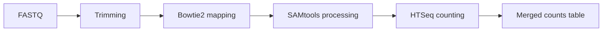

# RNake


Bacterial RNA-seq workflow for trimming, mapping, read counting, and merged count table generation.

---

## Pipeline



---

## Requirements

- Docker
- Linux environment
- Reference genome FASTA (`.fna`/`.fa`)
- Annotation GFF (`.gff`)

---

## Build

```bash
docker build -t rnake:latest .
```

---

## Quick Start

```bash
Go_Rnake.sh \
  -i /path/to/fastq \
  -o rnake_project \
  -g /path/to/genome.fna \
  -a /path/to/annotation.gff \
  -c 8
```

---

## Options

| Flag | Default | Description |
|---|---:|---|
| `-i` | - | Input read directory |
| `-o` | - | Project/output prefix |
| `-g` | - | Reference genome FASTA |
| `-a` | - | Annotation GFF |
| `-c` | `8` | Snakemake cores |
| `-m` | `rnake:latest` | Docker image |
| `-n` | off | Dry-run (`snakemake --dry-run`) |

---

## Input Notes

- Keep FASTQ naming consistent per run.
- If using Prokka GFF, remove FASTA tail when needed:

```bash
sed '/^##FASTA$/,$d' your_prokka_output.gff > cleaned.gff
```

---

## Outputs

Main output:

- `merged_counts_with_gene_names.csv`

---

## Maintainer

Heekuk Park
