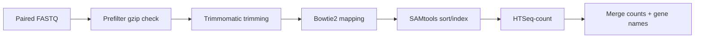

# RNake


Bacterial RNA-seq workflow for trimming, Bowtie2 mapping, HTSeq counting, and merged count-table generation with gene-name annotation.

## Current Entrypoints

- Wrapper: `Go_RNake.sh`
- Snakefile (current): `Go_bacteriaRNake_paired_V4.smk`

## Pipeline


```mermaid
flowchart LR
  A[Paired FASTQ] --> B[Prefilter gzip check]
  B --> C[Trimmomatic trimming]
  C --> D[Bowtie2 mapping]
  D --> E[SAMtools sort/index]
  E --> F[HTSeq-count]
  F --> G[Merge counts + gene names]
```

## Requirements

- Docker
- Linux shell
- Paired FASTQ files (or single-end)
- Reference genome FASTA (`.fna` / `.fa`)
- Annotation GFF (`.gff`) — Prokka GFF supported after FASTA-tail removal

## Build

```bash
cd RNake
docker build -t rnake:1.0 .
```

The wrapper defaults to image `rnake:1.0`; override with `-m <tag>` if needed.

## Docker Tool Inventory

Representative tools in the image:

- `snakemake`
- `trimmomatic`
- `bowtie2`
- `samtools`
- `htseq-count`
- supporting Python utilities for merging count tables

## Run A Single Tool From The Image

```bash
docker run --rm rnake:1.0 snakemake --version
docker run --rm rnake:1.0 bowtie2 --version
docker run --rm rnake:1.0 htseq-count -h
```

## Quick Start

```bash
./RNake/Go_RNake.sh \
  -i /path/to/fastq \
  -o rnake_project \
  -g /path/to/genome.fna \
  -a /path/to/annotation.gff \
  -c 8 \
  -K
```

Real example:

```bash
Go_RNake.sh \
  -i RNake/20261101_RNA_HKP \
  -o RNake/20261101_RNA_HKP_out \
  -g /media/uhlemann/Core3_V2/REF/ecoli.fna \
  -a /media/uhlemann/Core3_V2/REF/ecoli.gff \
  -s /home/uhlemann/heekuk_path \
  -c 8 \
  -K
```

## Options (`Go_RNake.sh`)

| Flag | Default | Description |
|---|---:|---|
| `-i` | - | Input FASTQ directory |
| `-o` | - | Project / output prefix (creates `<prefix>_RNAseq_output/`) |
| `-g` | - | Reference genome FASTA |
| `-a` | - | Annotation GFF |
| `-s` | script directory | Optional Snakefile directory override |
| `-c` | `8` | Snakemake cores |
| `-m` | `rnake:1.0` | Docker image tag |
| `-n` | off | Dry-run (`--dry-run`) |
| `-K` | off | Keep going (`--keep-going`) |
| `-P` | `1` | Periodic progress snapshots (`1` on, `0` off) |

## Input Layout

Supported FASTQ naming:

- `<sample>_R1_001.fastq.gz` / `<sample>_R2_001.fastq.gz`
- `<sample>_R1.fastq.gz` / `<sample>_R2.fastq.gz`
- `<sample>.R1.fastq.gz` / `<sample>.R2.fastq.gz`

Reference layout:

```text
RNA_ref/
  ecoli.fna
  ecoli.gff
```

If using a Prokka GFF, remove the FASTA tail before passing it to `-a`:

```bash
sed '/^##FASTA$/,$d' your_prokka_output.gff > cleaned.gff
```

## Output Layout

```text
<PROJECT>_RNAseq_output/
  1_trim/
    <sample>.R1.paired.output.fastq.gz
    <sample>.R2.paired.output.fastq.gz
  3_bowtie2_files/
    <sample>.sam / .bam
  4_htseq-count/
    <sample>.gene_id.minqual8.txt
  5_counts/
  merged_counts_with_gene_names.csv
```

Prefilter artifacts (sibling of input FASTQ dir):

```text
0_bad_fastqs/
  DONE.txt
  moved_bad_fastqs.tsv
```

Key file:

- `merged_counts_with_gene_names.csv` (final per-gene count matrix with gene names from the GFF)

## Operational Notes

- Wrapper runs a gzip-integrity prefilter before Snakemake; corrupt FASTQs are moved to sibling `0_bad_fastqs/` and logged in `moved_bad_fastqs.tsv`.
- Prefilter caches state in `0_bad_fastqs/DONE.txt` so it is skipped on reruns when no FASTQ is newer than the marker.
- Periodic progress snapshots (`trim` / `map` / `counts` / `merged`) print only when stage counts change; disable with `-P 0`.
- Lock errors are auto-handled by the wrapper (`--unlock` then retry).
- `INT/TERM` interrupt handling is enabled in the wrapper for clean child cleanup.

## Common Runs

Dry-run:

```bash
./RNake/Go_RNake.sh -i IN -o PROJ -g GENOME -a GFF -n
```

Production run:

```bash
./RNake/Go_RNake.sh -i IN -o PROJ -g GENOME -a GFF -K
```

Use a custom image tag:

```bash
./RNake/Go_RNake.sh -i IN -o PROJ -g GENOME -a GFF -m rnake:latest -K
```

## Troubleshooting

- `Docker image not found locally: rnake:1.0`
  - build with `docker build -t rnake:1.0 RNake`
- HTSeq reports `feature has no gene_id`
  - Prokka GFF with FASTA tail not removed — pre-process with the `sed '/^##FASTA$/,$d'` recipe above
- No samples detected
  - check that R1/R2 follow one of the supported naming patterns and that files survived the gzip-integrity prefilter
- Empty `merged_counts_with_gene_names.csv`
  - verify per-sample `4_htseq-count/<sample>.gene_id.minqual8.txt` files exist; rerun with `-K` to see which samples failed mapping

## Maintainer

Heekuk Park
