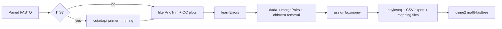

# daDake2


DADA2 amplicon pipeline for Illumina 16S and ITS sequencing. Replaces the monolithic `Go_dada2.R` with a Snakemake workflow that supports partial restarts at each checkpoint.

Supports three amplicon types:

| Type | Region | Platform |
|---|---|---|
| `standard_V3V4` | 16S V3–V4 | Illumina |
| `zymo_V1V2` | 16S V1–V2 (Zymo) | Illumina |
| `illumina_ITS` | ITS (Fungi) | Illumina |

## Current Entrypoints

- Wrapper: `Go_daDake2.sh`
- Snakefile: `Go_daDake2.smk`
- R scripts: `scripts/01_filter_trim.R` → `02_learn_errors.R` → `03_denoise_merge.R` → `04_taxonomy.R` → `05_export.R`

Single entrypoint design:
- use one wrapper + one Snakefile
- switch amplicon behavior with `-t standard_V3V4 | zymo_V1V2 | illumina_ITS`

## Pipeline



## Requirements

- R with DADA2 and phyloseq installed
- `qiime2` conda environment (for tree step)
- cutadapt (ITS only; must be on PATH or in PATH of the shell)
- Taxonomy DB: SILVA (16S) or UNITE (ITS) `.fa.gz`

No Docker required.

## Quick Start

```bash
# standard 16S V3V4
Go_daDake2.sh \
  -t standard_V3V4 \
  -i "ProjA,ProjB,ProjC" \
  -d /path/to/silva_nr99_v138.1_wSpecies_train_set.fa.gz \
  -c 8 \
  -K

# ITS
Go_daDake2.sh \
  -t illumina_ITS \
  -i "ProjA,ProjB" \
  -d /path/to/sh_general_release_dynamic_29.11.2022.fasta \
  -c 8 \
  -K
```

## Options (`Go_daDake2.sh`)

| Flag | Default | Description |
|---|---:|---|
| `-t` | - | Amplicon type: `standard_V3V4` \| `zymo_V1V2` \| `illumina_ITS` |
| `-i` | - | Comma-separated project FASTQ directories (`"ProjA,ProjB"`) |
| `-d` | - | Taxonomy DB path (SILVA or UNITE `.fa.gz`) |
| `-s` | same dir as script | Directory containing a Snakefile, or a specific `.smk` file |
| `-c` | `4` | Snakemake cores |
| `-m` | `10000` | Minimum FASTQ size in bytes (smaller → `failed.csv`) |
| `-D` | off | Delete filtered FASTQ dirs after a successful run |
| `-n` | off | Dry-run (`--dry-run`) |
| `-K` | off | Keep going (`--keep-going`) |

## Type-specific Parameters

| Parameter | `standard_V3V4` | `zymo_V1V2` | `illumina_ITS` |
|---|---|---|---|
| trimLeft F/R | 20 / 21 | 20 / 17 | — |
| truncLen F/R | 240 / 240 | 230 / 170 | 240 / 200 |
| Primer trimming | — | — | cutadapt |
| Host removal | No | No | No |
| Chimera minFold | 1 | 1 | default |
| Mapping files | Yes | Yes | No |
| Taxonomy `tryRC` | Yes | Yes | Yes |

## Input Layout

Each project directory (`ProjA/`, `ProjB/`, …) must contain paired-end FASTQ files:

```text
ProjA/
  SampleA_L001_R1_001.fastq.gz
  SampleA_L001_R2_001.fastq.gz
  SampleB_L001_R1_001.fastq.gz
  SampleB_L001_R2_001.fastq.gz
  ...
```

Supported naming patterns:
- `<sample>_L001_R1_001.fastq.gz` / `_L001_R2_001.fastq.gz`
- `<sample>_R1_001.fastq.gz` / `_R2_001.fastq.gz`
- `<sample>_R1.fastq.gz` / `_R2.fastq.gz`

Samples smaller than `-m` bytes are skipped and logged in `failed.csv` before the pipeline starts. Samples that produce zero reads after filterAndTrim are also appended to `failed.csv`.

## Output Layout

One `{proj}_dada2/` directory is created per input project:

```text
{proj}_dada2/
  failed.csv                                     ← skipped samples
  {proj}.{date}.qualityProfiles.pdf              ← raw QC plot
  {proj}.{date}.qualityProfiles.filt.pdf         ← filtered QC plot
  {proj}.{date}.splotErrors.errF1.pdf            ← forward error model
  {proj}.{date}.splotErrors.errF2.pdf            ← reverse error model
  1_out/
    {proj}.{date}.asv.csv                        ← ASV × sample count table
    {proj}.{date}.tax.csv                        ← taxonomy table
    {proj}.{date}.asvTable.csv                   ← merged ASV + taxonomy
    {proj}.{date}.track.csv                      ← read tracking per step
    {proj}.{date}.seqs.fna                       ← representative sequences
    {proj}.{date}.seqs.fna_tree/
      exported-tree/
        tree.nwk                                 ← rooted phylogenetic tree
  2_rds/
    filter_stats.rds
    errF.rds  errR.rds
    seqtab.nochim.{proj}.{date}.rds
    tax.{proj}.{date}.rds
    dada_stats.rds
    ps.{proj}.{date}.rds                         ← phyloseq object
  3_DADA2_filtered/                              ← 16S filtered FASTQs
  4_DADA2_filtered/                              ← ITS filtered FASTQs (ITS only)
  3_path.cut/                                    ← cutadapt output (ITS only)
  3_map/                                         ← empty mapping templates (16S only)
    empty.{date}.{proj}.mapping.csv
    empty.{date}.{proj}.mapping.SCRub.csv
  logs/
    cutadapt.log  filter_trim.log  learn_errors.log
    denoise_merge.log  assign_taxonomy.log  export_tables.log  qiime_tree.log
```

Key files:

- `1_out/{proj}.{date}.asvTable.csv` — primary output (ASV counts + taxonomy in one table)
- `1_out/{proj}.{date}.track.csv` — read counts at each step (input → filtered → denoised → merged → nonchim)
- `2_rds/ps.{proj}.{date}.rds` — phyloseq object for downstream R analysis
- `failed.csv` — samples excluded from analysis with reason
- `zip_projects/{proj}_dada2.zip` — split zip archive of the full project result folder

## Checkpointing

Each pipeline step writes an intermediate RDS before the next step begins. If a run is interrupted, Snakemake resumes from the last completed checkpoint on retry:

| Step | Checkpoint file |
|---|---|
| filterAndTrim | `2_rds/filter_stats.rds` |
| learnErrors | `2_rds/errF.rds`, `2_rds/errR.rds` |
| dada + merge + chimera | `2_rds/seqtab.nochim.{proj}.{date}.rds` |
| assignTaxonomy | `2_rds/tax.{proj}.{date}.rds` |
| export | `2_rds/ps.{proj}.{date}.rds` |

`learnErrors` is the most time-consuming step. After a successful run it is never re-executed unless its output is deleted.

## Workstation Layout

After `Go_toWorkstation.sh daDake2`, files are placed as:

```text
/home/uhlemann*/heekuk_path/
  Go_daDake2.sh          ← symlink → heekuk_path/daDake2/Go_daDake2.sh
  daDake2/
    Go_daDake2.sh
    Go_daDake2.smk
    scripts/
      01_filter_trim.R
      02_learn_errors.R
      03_denoise_merge.R
      04_taxonomy.R
      05_export.R
```

When running via symlink, the wrapper resolves the real path automatically. If it fails, use `-s` to specify the pipeline directory or a specific `.smk` file:

```bash
Go_daDake2.sh -t standard_V3V4 -i "ProjA" -d /path/to/silva.fa.gz \
  -s /home/uhlemann/heekuk_path/daDake2 -c 8 -K
```

## Common Runs

Dry-run (show execution plan):

```bash
Go_daDake2.sh -t standard_V3V4 -i "ProjA" \
  -d /media/uhlemann/core4/DB/DADA2/Bacteria/silva_nr99_v138.1_wSpecies_train_set.fa.gz \
  -n
```

Production (16S V3V4, multiple projects):

```bash
Go_daDake2.sh \
  -t standard_V3V4 \
  -i "ProjA,ProjB,ProjC" \
  -d /media/uhlemann/core4/DB/DADA2/Bacteria/silva_nr99_v138.1_wSpecies_train_set.fa.gz \
  -c 8 \
  -K
```

Production (Zymo V1V2):

```bash
Go_daDake2.sh \
  -t zymo_V1V2 \
  -i "ProjA,ProjB" \
  -d /media/uhlemann/core4/DB/DADA2/Bacteria/silva_nr99_v138.1_wSpecies_train_set.fa.gz \
  -c 8 \
  -K
```

Production (ITS):

```bash
Go_daDake2.sh \
  -t illumina_ITS \
  -i "ProjA,ProjB" \
  -d /media/uhlemann/core4/DB/DADA2/Fungi/sh_general_release_dynamic_29.11.2022.fasta \
  -c 8 \
  -K
```

## Operational Notes

- DATE is fixed at pipeline launch time (`yymmdd`) and baked into all output filenames — rerunning on a different day does not overwrite prior outputs.
- Taxonomy assignment uses `minBoot=80` and `tryRC=TRUE`.
- Taxonomy DB is provided by `-d`: typically SILVA for 16S and UNITE for ITS.
- Host removal is disabled by default for all current types to preserve old `Go_dada2.R` behavior.
- `addSpecies()` is currently not used because the wrapper writes `sdb: ""`.
- Mapping template CSVs (`3_map/`) are generated for 16S types only, as empty scaffolds for metadata entry.
- Lock errors are auto-handled by the wrapper (`--unlock` then retry).
- The wrapper supports `--keep-going` via `-K`, and the pipeline records small or missing FASTQ pairs in `failed.csv` before continuing with the remaining samples.
- Samples that filter to zero reads are also appended to `failed.csv`.
- qiime2 tree steps use `conda run -n qiime2 qiime`.
- Successful runs can optionally delete `3_DADA2_filtered`, `4_DADA2_filtered`, and `3_path.cut` with `-D`.

## Troubleshooting

- `Error: Snakefile not found` when running via symlink
  - use `-s /home/uhlemann/heekuk_path/daDake2` or `-s /home/uhlemann/heekuk_path/daDake2/Go_daDake2.smk`
- All samples in `failed.csv` / no passing samples
  - check FASTQ naming, pair completeness, and the `-m` minimum size threshold
- `track.csv` row names differ from old runs
  - current output normalizes to sample IDs like `SampleA` rather than full FASTQ filenames
  - check FASTQ file sizes with `ls -lh` and lower `-m` if needed
- `learnErrors` takes very long
  - expected for large projects; it reads up to 1M reads per strand
- qiime2 tree step fails with `conda: command not found`
  - ensure the shell initialises conda (check `~/.bashrc` or `~/.profile` sources `conda.sh`)
- ITS: many reads discarded by cutadapt
  - verify primers match the library prep; check `logs/cutadapt.log`

## Maintainer

Heekuk Park
