# longWGS


Bacterial ONT WGS workflow for assembly, polishing, QC, coverage, Kraken2 contamination screening, and annotation.

## Version Notes

- `Go_merge_rename_V1_0.sh`
  - adds `--merge-until-size` for whole-file merge limiting such as `200M`, `500M`, or `1G`
  - never cuts a `.fastq.gz` file mid-file
  - if the size limit is not reached, merges all available files for that barcode

- `V6_3`
  - normalizes `autocycler_metrics.tsv` so the output always includes a header row
  - carries the normalized Autocycler table into the summary Excel `AutocyclerTable` sheet
  - in `pipeline_mode=permissive`, Bakta failures are logged and marked without blocking summary Excel generation

- `V6_2`
  - adds `dnaapler` reorientation after Autocycler combine
  - converts reoriented GFA to FASTA with `autocycler gfa2fasta` before Medaka
  - generates `autocycler_metrics.tsv`
  - writes Autocycler metrics into the summary Excel as `AutocyclerTable`
  - runs `plassembler` on the full QC read set while keeping `raven`, `miniasm`, and `flye` on Autocycler subsamples
  - keeps existing `plassembler` cluster weighting (`Autocycler_cluster_weight=3`)
  - includes `dnaapler` and `filtlong` in the Docker image toolset

- `V6_1`
  - baseline Docker Snakefile with Autocycler, Medaka, CheckM2, Kraken2, Bakta, and summary workbook output

## Current Entrypoint

Use `Go_longWGS_V1_1.sh` as the current wrapper.

```bash
./longWGS/Go_longWGS_V1_1.sh -h
```

Current wrapper target Snakefile: `Go_longWGS_V6_3_docker.smk`

## Pipeline

```mermaid
flowchart LR
  P[barcode dirs\nfastq_pass/] --> Q[Go_merge_rename.sh\nmerge + rename]
  Q --> A[sample.fastq.gz]
  A --> B[Prefilter gzip check]
  B --> C[QC / optional porechop]
  C --> D[Autocycler assembly]
  D --> E[Medaka polish]
  E --> F[QUAST + CheckM2]
  F --> G[Coverage]
  G --> H[Kraken2 on clean reads]
  H --> I[Bakta annotation]
  I --> J[Optional Bandage images]
```



## Requirements

- Docker
- Linux shell
- ONT FASTQ files (`*.fastq.gz` or `*.fq.gz`)
- DB directory mounted as `-d`, including:
  - `medaka_models/`
  - `plassembler_db/`
  - `bakta_DB/`
  - `CheckM2_database/`
  - `kraken2DB/` or `kraken2_db/` or `kraken_db/` containing a Kraken2 database

## Build

The wrapper runs image name `longwgs` directly, so tag exactly as below.

```bash
cd longWGS
docker build -t longwgs .
```

## Docker Tool Inventory

Main tools included in the image (pipeline-dependent):

- `snakemake`
- `autocycler`
- `dnaapler`
- `filtlong`
- `medaka`
- `quast`
- `checkm2`
- `kraken2`
- `bakta`
- `samtools`
- supporting utilities used by workflow rules

## Run A Single Tool From The Image

Examples (without conda on host):

```bash
# Snakemake version
docker run --rm longwgs snakemake --version

# CheckM2 help (example)
docker run --rm longwgs checkm2 --help

# Bakta help (example)
docker run --rm longwgs bakta --help
```

## Pre-processing: Merge & Rename

ONT sequencing output typically produces per-barcode directories (e.g. `fastq_pass/barcode01/`).
Before running the pipeline, merge the per-read files into a single fastq.gz per sample and
rename them from barcode names to sample names using `Go_merge_rename.sh` or the size-limited `Go_merge_rename_V1_0.sh`.

```text
fastq_pass/
  barcode01/  →  merged_fastqs/KP0011.fastq.gz
  barcode02/  →  merged_fastqs/KP0063.fastq.gz
  ...
```

**Map file format** (tab or space separated):

Recommended with header:

```text
old  new
barcode01  KP0011
barcode02  KP0063
...
```

Headerless format is also supported and is interpreted by default as `old  new`:

```text
barcode01  KP0011
barcode02  KP0063
...
```

Legacy `sample  barcode` files are still supported for backward compatibility:

```text
KP0011  barcode01
KP0063  barcode02
...
```

Recognized header aliases:

- old-name column: `old`, `old_name`, `current`, `current_name`, `source`, `from`, `barcode`
- new-name column: `new`, `new_name`, `sample`, `sample_name`, `target`, `to`

**Run:**

```bash
# dry-run first
bash Go_merge_rename.sh -i fastq_pass -o merged_fastqs -m samples_barcodes.txt -n

# apply
bash Go_merge_rename.sh -i fastq_pass -o merged_fastqs -m samples_barcodes.txt
```

**Optional size-limited merge (`Go_merge_rename_V1_0.sh`):**

This version merges whole `.fastq.gz` files until the cumulative compressed size
reaches or exceeds a user-defined limit. Files are never cut mid-file.
If a barcode does not have enough data to reach the limit, all available files are merged.

```bash
# dry-run with a 200M merge cap
bash Go_merge_rename_V1_0.sh -i fastq_pass -o merged_fastqs -m rename_map.tsv -n --merge-until-size 200M

# apply with a 500M merge cap
bash Go_merge_rename_V1_0.sh -i fastq_pass -o merged_fastqs -m rename_map.tsv --merge-until-size 500M
```

The `merged_fastqs/` directory is then used as input (`-i`) for the pipeline.

The same rename-table convention is also supported by `Go_rename_barcodes.sh` for renaming completed longWGS output directories later.

## Quick Start

```bash
./longWGS/Go_longWGS_V1_1.sh \
  -i /path/to/fastq \
  -o /path/to/output \
  -d /path/to/db \
  -M strict \
  -p 0 \
  -K
```

Real example:

```bash
Go_longWGS.sh \
  -i 1_merged_fastqs \
  -o 2_longWGS_out \
  -d /media/uhlemann/Core3_V2/DB/longWGS_DB \
  -s /home/uhlemann/heekuk_path \
  -M strict \
  -p 0 \
  -K
```

## Options

| Flag | Default | Description |
|---|---:|---|
| `-i` | - | Input FASTQ directory |
| `-o` | - | Output directory |
| `-d` | - | DB root mounted to container as `/db` |
| `-s` | script directory | Optional Snakefile directory override |
| `-p` | `0` | `0`: skip porechop, `1`: run porechop |
| `-M` | `strict` | Pipeline mode: `strict` stops on stage failures, `permissive` records failures and still builds available summaries |
| `-n` | off | Dry-run (`snakemake --dry-run`) |
| `-K` | off | Keep going on independent failures (`--keep-going`) |

## What The Wrapper Does

1. Prefilter input FASTQ files before Snakemake.
2. Move corrupted FASTQ files to sibling folder `0_bad_fastqs/`.
3. Cache prefilter state in `0_bad_fastqs/DONE.txt`.
4. Print periodic progress snapshots while running.
5. Auto-retry lock errors (`--unlock` then rerun).
6. Handle `INT/TERM` and clean child/background processes.
7. Generate Bandage images when `Bandage` is available on host and GFA exists.

## Input Layout

```text
FASTQ_DIR/
  sample1.fastq.gz
  sample2.fastq.gz
  ...
```

## Output Layout

```text
OUTDIR/
  1_QC/
  2_quast/
  3_autocycler/
  4_medaka/
  5_checkm2/
  6_coverage/
  7a_kraken2/
  7_bakta/
  8_Bandage_image/          # created when Bandage step runs
  0_failed_samples.tsv      # created by workflow on rule failures
  checkm2_coverage_summary.xlsx
```

Prefilter artifacts:

```text
<parent_of_FASTQ_DIR>/0_bad_fastqs/
  DONE.txt
  moved_bad_fastqs.tsv
  *.fastq.gz                # moved bad files
```

## Common Runs

Dry-run:

```bash
./longWGS/Go_longWGS_V1_1.sh -i IN -o OUT -d DB -n
```

Production run (recommended):

```bash
./longWGS/Go_longWGS_V1_1.sh -i IN -o OUT -d DB -M strict -K
```

Enable porechop:

```bash
./longWGS/Go_longWGS_V1_1.sh -i IN -o OUT -d DB -p 1 -M strict -K
```

Finish the run and still write the summary workbook even if some Bakta jobs fail:

```bash
./longWGS/Go_longWGS_V1_1.sh -i IN -o OUT -d DB -M permissive -K
```

## Troubleshooting

- `docker: image not found longwgs`
  - build with `docker build -t longwgs longWGS`
- `Kraken2 DB not found under DB root`
  - place a Kraken2 DB under `DB/kraken2DB/<your_db>` or `DB/kraken2_db/<your_db>`
- lock-related failure in log
  - wrapper already retries with `--unlock`
- repeated prefilter not running
  - expected when input files are older than `0_bad_fastqs/DONE.txt`
- no Bandage images
  - install `Bandage` on host or skip (pipeline core output is unaffected)
- Bakta failures block the final Excel
  - rerun with `-M permissive -K` to log failed samples in `0_failed_samples.tsv` and continue to `checkm2_coverage_summary.xlsx`
- How to read Bakta status in permissive mode
  - `RunStatus` sheet: `bakta_done=True` means success, `bakta_failed=True` means the sample was skipped after failure
  - `7_bakta/<sample>/FAILED.txt` marks samples where Bakta failed

## Maintainer

Heekuk Park
