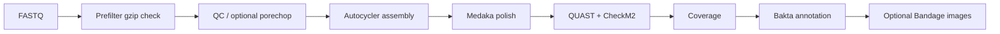

# longWGS


Bacterial ONT WGS workflow for assembly, polishing, QC, coverage, and annotation.

## Current Entrypoint

Use `Go_longWGS_V1_1.sh` as the current wrapper.

```bash
./longWGS/Go_longWGS_V1_1.sh -h
```

## Pipeline



## Requirements

- Docker
- Linux shell
- ONT FASTQ files (`*.fastq.gz` or `*.fq.gz`)
- DB directory mounted as `-d`, including:
  - `medaka_models/`
  - `plassembler_db/`
  - databases used by rules (for example Bakta and CheckM2)

## Build

The wrapper runs image name `longwgs` directly, so tag exactly as below.

```bash
cd longWGS
docker build -t longwgs .
```

## Quick Start

```bash
./longWGS/Go_longWGS_V1_1.sh \
  -i /path/to/fastq \
  -o /path/to/output \
  -d /path/to/db \
  -p 0 \
  -K
```

## Options

| Flag | Default | Description |
|---|---:|---|
| `-i` | - | Input FASTQ directory |
| `-o` | - | Output directory |
| `-d` | - | DB root mounted to container as `/db` |
| `-s` | script directory | Optional Snakefile directory override |
| `-p` | `0` | `0`: skip porechop, `1`: run porechop |
| `-n` | off | Dry-run (`snakemake --dry-run`) |
| `-K` | off | Keep going on independent failures (`--keep-going`) |

## What The Wrapper Does

1. Prefilter input FASTQ files before Snakemake.
2. Move corrupted FASTQ files to sibling folder `0_bad_fastqs/`.
3. Cache prefilter state in `0_bad_fastqs/DONE.txt`.
4. Print periodic progress snapshots while running.
5. Auto-retry lock errors (`--unlock` then rerun).
6. Handle `INT/TERM` and clean child/background processes.
7. Generate Bandage images when `Bandage` is available on host and GFA exists.

## Input Layout

```text
FASTQ_DIR/
  sample1.fastq.gz
  sample2.fastq.gz
  ...
```

## Output Layout

```text
OUTDIR/
  1_QC/
  2_quast/
  3_autocycler/
  4_medaka/
  5_checkm2/
  6_coverage/
  7_bakta/
  8_Bandage_image/          # created when Bandage step runs
  0_failed_samples.tsv      # created by workflow on rule failures
```

Prefilter artifacts:

```text
<parent_of_FASTQ_DIR>/0_bad_fastqs/
  DONE.txt
  moved_bad_fastqs.tsv
  *.fastq.gz                # moved bad files
```

## Common Runs

Dry-run:

```bash
./longWGS/Go_longWGS_V1_1.sh -i IN -o OUT -d DB -n
```

Production run (recommended):

```bash
./longWGS/Go_longWGS_V1_1.sh -i IN -o OUT -d DB -K
```

Enable porechop:

```bash
./longWGS/Go_longWGS_V1_1.sh -i IN -o OUT -d DB -p 1 -K
```

## Troubleshooting

- `docker: image not found longwgs`
  - build with `docker build -t longwgs longWGS`
- lock-related failure in log
  - wrapper already retries with `--unlock`
- repeated prefilter not running
  - expected when input files are older than `0_bad_fastqs/DONE.txt`
- no Bandage images
  - install `Bandage` on host or skip (pipeline core output is unaffected)

## Maintainer

Heekuk Park
