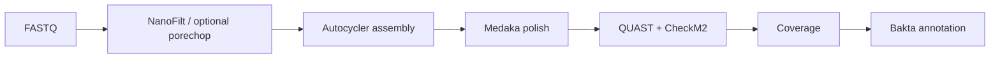

# longWGS


Bacterial ONT WGS workflow for assembly, polishing, QC, depth analysis, and annotation.

---

## Pipeline



---

## Requirements

- Docker
- Linux environment
- ONT FASTQ files (`*.fastq.gz`)
- DB root containing Bakta + CheckM2 DB

---

## Build

```bash
docker build -t longwgs:1.0 .
```

---

## Quick Start

```bash
Go_longWGS.sh \
  -i /path/to/fastq \
  -o longwgs_out \
  -d /path/to/longWGS_DB \
  -s /path/to/snakefile_dir \
  -p 0
```

---

## Options

| Flag | Default | Description |
|---|---:|---|
| `-i` | - | Input FASTQ directory |
| `-o` | - | Output directory |
| `-d` | - | DB root (`bakta_DB`, `CheckM2_database`) |
| `-s` | - | Snakefile directory |
| `-p` | `0` | `0`: skip porechop, `1`: run porechop_abi |
| `-n` | off | Dry-run (`snakemake --dry-run`) |

---

## Inputs

```text
FASTQ_DIR/
  sample1.fastq.gz
  sample2.fastq.gz
  ...
```

```text
DB/
  bakta_DB/
  CheckM2_database/
    uniref100.KO.1.dmnd
```

---

## Outputs

```text
OUTDIR/
  1_QC/
  2_quast/
  3_autocycler/
  4_medaka/
  5_checkm2/
  6_coverage/
  7_bakta/
  checkm2_coverage_summary.xlsx
```

---

## Notes

- Wrapper auto-retries lock issues with `--unlock`.
- `gzip -t sample.fastq.gz` is recommended before run.

---

## Maintainer

Heekuk Park
