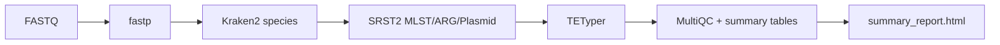

# shortWGS


Bacterial Illumina WGS workflow for QC, species inference, typing, resistance/plasmid screening, and summary reporting.

---

## Pipeline



---

## Requirements

- Docker
- Linux environment
- Paired FASTQ files (`*.fastq.gz`)
- WGS DB root (`WGS_DB2`-style)
- Kraken2 DB
- Rmd template at:
  - `/home/uhlemann/heekuk_path/GoWGS/scripts/20251007_Summary_WGS_tem_v3.Rmd`

---

## Build

```bash
docker build -t shortwgs:1.0 .
```

---

## Quick Start

```bash
Go_shortWGS.sh \
  -i /path/to/fastq \
  -o shortwgs_out \
  -d /path/to/WGS_DB2 \
  -k /path/to/kraken2_db \
  -r /path/to/GoWGS \
  -c 8
```

---

## Options

| Flag | Default | Description |
|---|---:|---|
| `-i` | - | Input FASTQ directory |
| `-o` | - | Output directory |
| `-d` | - | WGS DB root (`WGS_DB2`) |
| `-k` | - | Kraken2 DB directory |
| `-r` | - | Host `GoWGS` directory for fixed Rmd path |
| `-c` | `8` | Snakemake cores |
| `-m` | `shortwgs:1.0` | Docker image |
| `-n` | off | Dry-run (`snakemake --dry-run`) |

---

## Inputs

FASTQ naming supported:

- `<sample>_R1_001.fastq.gz` / `<sample>_R2_001.fastq.gz`
- `<sample>_R1.fastq.gz` / `<sample>_R2.fastq.gz`
- `<sample>.R1.fastq.gz` / `<sample>.R2.fastq.gz`

Expected DB layout:

```text
WGS_DB2/
  CARD/                 (*.fasta)
  PlasmidFinder/        (*.fasta)
  MLST/
    a_baumannii/
    e_coli/
    k_pneumoniae/
    ...
  tetyper/
    struct_profiles.txt
    snp_profiles.txt
```

---

## Outputs

```text
shortwgs_out/
  1_fastp_out/
  2a_kraken2/
  2_ST_srst2_out/
  3_ARGs_srst2_out/
  4_Plasmid_srst2_out/
  5_TETyper/
  multiqc_report.html
  summary_master.csv
  summary_report.html
  skip.log
```

Key files:

- `2_ST_srst2_out/mlst_master.csv`
- `5_TETyper/tetyper_summary.json`
- `summary_master.csv`
- `summary_report.html`

---

## Maintainer

Heekuk Park
